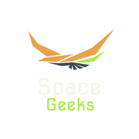

<!--
*** Thanks for checking out the Best-README-Template. If you have a suggestion
*** that would make this better, please fork the repo and create a pull request
*** or simply open an issue with the tag "enhancement".
*** Thanks again! Now go create something AMAZING! :D
-->


<!-- PROJECT SHIELDS -->
<!--
*** I'm using markdown "reference style" links for readability.
*** Reference links are enclosed in brackets [ ] instead of parentheses ( ).
*** See the bottom of this document for the declaration of the reference variables
*** for contributors-url, forks-url, etc. This is an optional, concise syntax you may use.
*** https://www.markdownguide.org/basic-syntax/#reference-style-links
-->

<!-- PROJECT LOGO -->
<br />
<p align="center">
  <a href="https://github.com/Hp-175/Space_Geeks">
    
  </a>

  <h3 align="center">Space Geeks</h3>

  <p align="center">
    A website for space enthusiastic.
    <br />
    <a href="https://github.com/Hp-175/Space_Geeks"><strong>Explore the docs »</strong></a>
    <br />
    <br />
    <a href="https://github.com/Hp-175/Space_Geeks">View Demo</a>
    ·
    <a href="https://github.com/Hp-175/Space_Geeks/issues">Report Bug</a>
    ·
    <a href="https://github.com/Hp-175/Space_Geeks/issues">Request Feature</a>
  </p>
</p>


<!-- TABLE OF CONTENTS -->
<details open="open">
  <summary>Table of Contents</summary>
  <ol>
    <li>
      <a href="#about-the-project">About The Website</a>
      <ul>
        <li><a href="#built-with">Built With</a></li>
      </ul>
    </li>
    <li>
      <a href="#getting-started">Getting Started</a>
      <ul>
        <li><a href="#prerequisites">Prerequisites</a></li>
        <li><a href="#installation">Installation</a></li>
      </ul>
    </li>
    <li><a href="#usage">Usage</a></li>
    <li><a href="#roadmap">Roadmap</a></li>
    <li><a href="#contributing">Contributing</a></li>
    <li><a href="#license">License</a></li>
    <li><a href="#contact">Contact</a></li>
  </ol>
</details>


<!-- ABOUT THE PROJECT -->
## About The Project

A Responsive website for space enthusiastic for sharing knowledge. Where users can share image, write a blog about it and can also perform edit and delete operation.

### Some ScreenShots Of Website

 [![Logout Screen Shot][Header-Logout]]
 * Header Contains three categories of information and favourite section for each category for each user, with login and signup option.
 * Also a button for posting image and its details such as title, information, credits.

[![Login Screen Shot][Header-Login]]
 * As shown a header after successfull login it shows favourite categories for loged in user. 

[![Product Name Screen Shot][homepage]]
 * A full view of home page with fix image as background with effect of hiding when page is scrolled up.

[![Posts Screen Shot][posts]]
 * Home page view of each three section where posts are visible.
 * Here title is written on image at bottom center.

[![Details Screen Shot][details]]
 * After clicking on image it nevegates to detailed section of image.
 * Here image is displayed as per the screen size along with its title and information. And also at the bottom of the information username of person who has posted image and also credits.
 * At the bottom left of the image by clicking on heart icon any one can remove and add post into his/her favourite list.
 * At the bottom right corner two option edit and delete is there.this option can be used by only the person who owns the post.

[![Commentbox Screen Shot][comments]]
 * At the bottom of the page of each post a comment section exist where people can comment on post.
 * So,here username and date of comment is displayed along with comment.
 * After click on x(cross) symbole person who has entered comment can remove comment.

[![Favourite Screen Shot][favourites]]
 * Here it displays all the favourite posts of loged in user for each category.
 * By click on heart at the top right corner one can remove post from list of favourites.

### Built With

* [Express](https://expressjs.com/)
* [Node](https://nodejs.org/en/)
* [React](https://reactjs.org/)
* [Redux](https://redux.js.org/)
* [Mongoose](https://mongoosejs.com/)


<!-- GETTING STARTED -->
## Getting Started

* Create configure.js file into Space_Geeks_Server and add below code.
    ```
    module.exports={
        'secretKey':'<Your_Secrete_key>',
        'mongoUrl':'<url to mongodb database>',
    }

    ```
* Install node from here : https://nodejs.org/en/

* open cmd and go to Space_Geeks_Server location and enter,
    ```
        npm install
    ```
* Now,open cmd and go to space_geeks_client location and enter,
    ```
        yarn install
    ```
* open cmd and go to Space_Geeks_Server location and enter,
    ```
        npm start
    ```
* Now,open cmd and go to space_geeks_client location and enter,
    ```
        yarn start
    ```

### Prerequisites

* Javascript
* CSS
* Express
* Node
* React
* Redux
* Mongoose


## Contributing

Contributions are what make the open source community such an amazing place to be learn, inspire, and create. Any contributions you make are **greatly appreciated**.

1. Fork the Project
2. Create your Feature Branch (`git checkout -b feature/AmazingFeature`)
3. Commit your Changes (`git commit -m 'Add some AmazingFeature'`)
4. Push to the Branch (`git push origin feature/AmazingFeature`)
5. Open a Pull Request

## Contact

* Hrushi Patel - [@Hp-175](https://github.com/Hp-175) -  patelhrushi16@gmail.com
* Project Link: [https://github.com/Hp-175/Space_Geeks](https://github.com/Hp-175/Space_Geeks)

[contributors-shield]: https://github.com/Hp-175/Space_Geeks
[Header-Logout]: images/headerLogedout.png
[Header-Login]: images/headerLogedin.jpg
[posts]: images/homepage.jpg
[homepage]: images/HomePage.png
[details]: images/details.jpg
[comments]: images/commentbox.jpg
[favourites]: images/favourites.jpg
